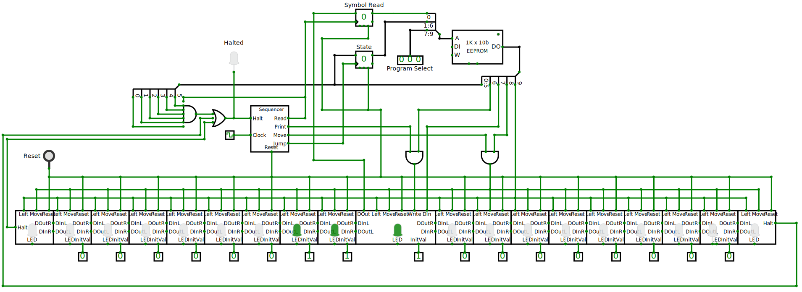

# A simple Turing Machine.

This in an exercise to make an digital circuit that can show a [Turing Machine](https://en.wikipedia.org/wiki/Turing_machine "Wikipedia") in operation.

It includes the Turing Machine itself and an electronic *tape* replacing the theoretical paper tape.

It runs on [CircuitVerse](https://circuitverse.org/), an online digital circuit emulator.  The working model can be found [here](https://circuitverse.org/users/393554/projects/turing-machine-68b18b14-174b-450a-bf01-8f8b94b983d0).

The online version above has some extras useful in development and debugging that are not relevant to the current discussion.  The following image provides a simplified view of the machine:

A more detailed description can be found in [this project site](https://new.satyam.com.ar/TuringMachine/).

### Batch programming

The [on-line emulator](https://circuitverse.org/users/393554/projects/turing-machine-68b18b14-174b-450a-bf01-8f8b94b983d0) is pre-loaded with a series of [programs](https://new.satyam.com.ar/TuringMachine#programs) which can be selected with the `Program Select` input. 

The source of those programs are in the file `turing.program.txt` which are converted to a string of byte codes that can be loaded into the memory of the emulator.  Those bytes are in `turing.program.bytes`.

Those byte codes are generated by the `docs/src/convert.mjs` script.  A shortcut `convert` for Linux can be found in the root of this repository.  The script runs with [zx](https://google.github.io/zx/), a JavaScript running environment for [NodeJS](https://nodejs.org/).

Otherwise, single scripts can be converted using the web page provided, as described in the [docs](https://new.satyam.com.ar/TuringMachine#converting-the-states-table-to-byte-codes)

