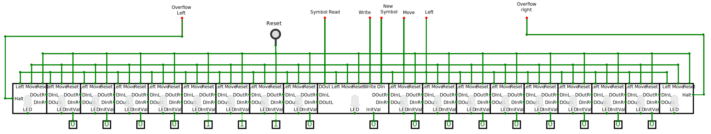

- [Description](#description)
  - [The Machine itself](#the-machine-itself)
    - [The State Table.](#the-state-table)
    - [The Latches](#the-latches)
    - [The Actions](#the-actions)
    - [The Sequencer.](#the-sequencer)
      - [Operation of the Sequencer](#operation-of-the-sequencer)
      - [Inside the Sequencer](#inside-the-sequencer)
    - [A sample run](#a-sample-run)
    - [Converting the States Table to byte codes](#converting-the-states-table-to-byte-codes)
    - [Possible Machine improvements](#possible-machine-improvements)
  - [The *tape*](#the-tape)
- [Operation](#operation)
  - [Programs](#programs)
    - [000: Copy](#000-copy)
    - [001: Busy Beaver](#001-busy-beaver)
    - [010: An alternate copy](#010-an-alternate-copy)
    - [011: Overflow right](#011-overflow-right)
    - [100: Overflow left](#100-overflow-left)
    - [Custom programs](#custom-programs)
- [Stretching the tape](#stretching-the-tape)


Appendix: [Converter](./convert/index.html)

A Turing Machine is an theoretical machine devised by the British scientist [Alan Turing](https://en.wikipedia.org/wiki/Alan_Turing) for the purpose of proving basic principles of automated data processing.  See the Wikipedia article on the [Turing Machine](https://en.wikipedia.org/wiki/Turing_machine) for further explanation.

The Machine has a *tape* which may have *marks* written on it. The Machine has a read/write *head* which can read a *symbol* from the tape, either a *mark*, that is, a `1` or nothing `0`. Depending on the *state* of the Machine and the *symbol* read, it may write a mark, a `1`, or erase the existing mark, that is, write a `0`, or leave that position in the *tape* or *cell* as it is.  Additionally it may *move* the *tape* one position either to the left or to the right, or stay put.  Finally, the Machine can switch to another *state*, which will determine its next actions.

The Machine was never intended to perform any practical computations, it is awfully slow, but the model is simple enough that allows it to be studied theoretically and produce mathematical proves of basic statements which are the basis of all modern computers, one of which is that any machine or programming language that is [Turing Complete](https://en.wikipedia.org/wiki/Turing_completeness) is capable of doing whatever data processing tasks any other Turing Complete machine can do.  Obviously the Turing Machine is Turing Complete, but that does not mean that it is practical in any sense, it takes ages to do the most basic operations.  Actually, no actual physical machine can be really *complete* since there is no way you could have an **infinite** *tape*, as the Machine actually requires.

For example, this is an actual *program* to copy a bunch of contiguous bits derived from [Wikipedia](https://en.wikipedia.org/wiki/Turing_machine_examples#A_copy_subroutine)


| Current<br/>State | Current<br/>Symbol | Print | Move  | Next<br/>State |
| :---------------: | :----------------: | :---: | :---: | :------------: |
|        s0         |         0          |   -   |   R   |       s0       |
|        s0         |         1          |   -   |   -   |       s1       |
|        s1         |         0          |   -   |   -   |      Halt      |
|        s1         |         1          |   0   |   R   |       s2       |
|        s2         |         0          |   -   |   R   |       s3       |
|        s2         |         1          |   -   |   R   |       s2       |
|        s3         |         0          |   1   |   L   |       s4       |
|        s3         |         1          |   -   |   R   |       s3       |
|        s4         |         0          |   -   |   L   |       s5       |
|        s4         |         1          |   -   |   L   |       s4       |
|        s5         |         0          |   1   |   R   |       s1       |
|        s5         |         1          |   -   |   L   |       s5       |

This is a [State-transition table](https://en.wikipedia.org/wiki/State-transition_table) or *State Table* for short and it is what controls the operation of the Machine.

The Machine always starts at the first line, in this case with the state `s0`.  The labels assigned to the states are completely arbitrary, they could be `A`, `B` and `C` or whatever as long as they are unique to each state.  

Then it reads from the *tape* a *symbol*, either a `0` or a `1`, or, as it usually is referred in the theoretical papers, a *mark*  or nothing.  Actually, there are Machines that use more than two symbols but, since every Turing Machine is equivalent to any other, a machine with only a `0` or `1` is equivalent to one with `0`, `1` and something else.

So, the first two columns, the *state* and the *symbol* read decide what to do next. The Machine can print a `0`, a `1` or do nothing, which in this table is represented by a hyphen `-`.  It doesn't mean it prints a hyphen, it means it doesn't change what is already there. 

The next column indicates whether to *move* the tape and which way, `L` for left and `R` for right and, once again, `-` for not moving at all.

The final column tells which *State* it should go next.  The labels in this column must be any of the labels of the states of the first column. There is a *Next State* labeled *Halt* which means the program has finished, the computation is done, the Machine stops.

Thus, for example, the very first row, which is the starting point, is state `s0`.  If it reads a `0` from the tape, it does not need to change it but it should move the tape to the right.  Finally it should go to the state `s0`, that is, it would remain in the current state.  

This line means that the *tape* will move right until it finds a *mark*, that is, a `1`.  Then the second line applies.  The Machine is still in the `s0` state, but now the *symbol read* from the tape is a `1` so it will leave that `1` be, it won't move the tape (since it has finally found what it was looking for) but it will go to the state `s1`.

The copy program will locate the first group of consecutive `1` symbols to the left of the reading *head* and make a copy of that group.  For example, if it finds `111` it will produce `1110111` with the `0` right under the *head*.

## Description

The circuit in the [on-line emulator](https://circuitverse.org/users/393554/projects/turing-machine-68b18b14-174b-450a-bf01-8f8b94b983d0) is made of two distinct sections.  The upper half is the Turing Machine itself. The bottom part is the *tape* which the Machine is supposed to manipulate.  The *tape* in the theoretical Machine should be infinite, which is not possible for actual machines.  This presents limitations, in the emulator the copy program will work with up to four `1`s, but it will overflow, i.e. *run out of tape*, with five or more.

The following sections describe, the *Machine*, which is the top of the the full circuit in [the on-line emulator](https://circuitverse.org/users/393554/projects/turing-machine-68b18b14-174b-450a-bf01-8f8b94b983d0) followed by the *tape* which is the bottom half ot that circuit.   

The complete circuit has same extra features mostly to check its operation and for debugging.  There are several labeled boxes all around showing the values at different points in the circuit and also a counter labeled `Step` to keep track of its operation.  Since they do not affect the operation, they have been omitted from the images and descriptions below.

### The Machine itself


The green lines carry a single bit, the emulator uses different shades of green for wires carrying a `1` or a `0`, the black lines are groups of wires of various widths.  They are what is usually called a *bus* as they may carry several bits just as an actual bus carries several passengers. Since each of the wires in the bus can have a `0` or a `1` the lines are a bit thicker and black, since there is no sensible way to represent that information with color.

When lines cross, if they do connect, there is a dot at the crossing.

The labeled red dots at the end of some wires, mostly at the bottom of the image were added to this image to represent places where it connects to the rest of the circuit, in this case, the *tape*.  CircuitVerse would allow me to put this whole circuit in a separate diagram and make the connections clear, but it would prevent me from showing both the *machine* and the *tape* in the same diagram.  The actual circuit in the emulator has no such red dots.

#### The State Table.

The Machine is controlled by a memory containing the actions to perform for any state.  It is stored on the EEPROM on the top right of the image.  There is no fundamental reason to use an EEPROM except that the regular [ROM offered by CircuitVerse](https://docs.circuitverse.org/chapter4/chapter4-sequentialelements#rom) is quite lacking.

The relevant pins in this memory are the ones labeled `DO` which is where the data comes out, hence Data Out, and the one labeled `A` for address.  The rest are not used.

The addresses for this memory represent the state of the machine at any point.   It is configured as follows:

* **Program**: 3 bits which allows for 8 different programs or *state tables* that can be stored at once.
* **States**: 6 bits for a total of 64 machine states
* **Symbol**: 1 bit for the symbol, `0` or `1`, under the *head*, which determines which actions to execute for the given state.
  
Up to 8 programs can be stored in the memory.  They can be selected with the input box labeled `Program Select` immediately to its left. The image shows the program `000` (binary).

Each program is a table of up to 64 possible states.  The actions associated with the state depend on the *symbol* present under the *head*.

The black lines coming out on either end of the memory represent a *bus*, a shorthand representation for a set parallel wires which, if drawn separately, would clutter the diagram. 

There are *splitters* in the *buses* coming out of the memory, which have numbers in the branches.  They represent the set of bits or wires split on each branch, with `0` representing the least significant bit. 

The *splitter* to the left, the one for the address has the 3 bits `7` to `9` from the program selector, the next from `1` to `6` represent the *state* and the `0` at the top, the least significant bit, is for the *symbol* read from the head.

#### The Latches

Since the *tape* moves, it is not safe to use the *symbol* straight from the *head* as the tape may move, instead, both the *symbol* and the current *state* are held on or *latched* into two D-type flip-flops (or DFFs) labeled `Symbol Read` and `State`.   DFFs are simple circuits which store just 1 bit or set of bits.  It doesn't have addresses like RAM or ROM memories since they hold just one bit or set of bits.  The `Symbol Read` DFF holds just 1 bit, the *symbol*, while the *state* DFF holds 6 bits.  It would be nice if CircuitVerse showed a single-bit DFF different from a multi-bit DFF like the *state*, perhaps like a deck of stacked playing cards.

DFFs basically have an *input* (on the left side, top), a *trigger* (on the left side, bottom, with a triangle) and an *output* (on the right side, top).   When the *trigger* input is pulsed, it latches whatever is on the *input* and holds it until another *trigger* comes.  The latched bit is reflected in the *output* pin. The emulator also shows in hexadecimal the value inside the DFF.

By the way, how do you know which pin is which in a circuit element such as the DFF?  In the interactive emulator, the name of the pin pops up when the cursor hovers above it.  However, in sub-circuits, which we will see below, the labels for the pins show on the inside of the block representing it.

The other pin used in this circuit is the *Reset* pin, the rightmost on the bottom edge. It ensures the bit or bits stored in it are set to `0` when the circuit is powered or, in this case, when the button labeled `Reset` in the bottom-left corner of the image is pressed.  The reset ensures that the DFFs for the *state* go to `0` when turned on, so it starts at the first row in the *State Table* for whichever program was selected.  It also resets the top DFF for the *Symbol Read* DFF, though it isn't relevant in this circuit, it is just common practice to reset components that can be reset.

Later on we will see where the data stored in this DFFs comes from.  

#### The Actions

So far we  have discussed the memory used to store the *state table* and the associated circuit to select the program, and look up the various *states* and the actions to perform depending on the *symbol* read.  On the right-hand side of the memory, the `DO` (Data Output) pin consists of 10 bits which control the actions to be performed by the machine.  The line coming out of that `DO` output is a *bus* which gets broken down in the *splitter* as follows:

* **Next State**: 6 bits (bits `0` to `5`), the state that follows the current one.  The state `0x3f` or decimal 63 (all bits one) is reserved for HALT, which means the program has finished.
* **Write**: (bit `6`) If `1`, the value in **New Symbol** is actually written on the tape, if `0`, it is left as-is, which would be equivalent to a hyphen `-` on the *State Table*.
* **New Symbol**: (bit `7`) The *symbol* (`0` or `1`) to print on the tape at the current location, valid only if **Write** is `1`, ignored otherwise.
* **Move**: (bit `8`) A `1` means the *tape* must move and a `0` that it won't move, equivalent to a `-` in the *State Table*.
* **Left**: (bit `9`) Direction to move the tape, if the **Move** signal is `1`. A `1` means it should move left, a `0` means *not left* that is right.

The signals, `New Symbol` and `Left` go directly to the *tape* circuit below and will be described later.  

The `Next State` bits go to two destinations.  One is the `State` DFF where they will eventually be used as part of the memory address.   The other destination is a big AND gate at the left edge of the circuit.  An AND gate produces a `1` when and only when all of its inputs are `1`.  This big AND gate detects when the next state is all-ones (`0x3f`, decimal 63 or `111111`) which is the code for **Halt** indicating the program has reached the end.  This `halt` signal (along others described further down) is fed to the *Sequencer* circuit, described next.

The *State Table* must be translated to these bit patterns that encode the actions. For example, the table above will be converted to this:

<table>
<thead>
<tr>
<th colspan="5">State table</th>
<th colspan="3" title="The memory address, split into its components">
Memory Address
</th>
<th rowspan="2">Memory Data</th>
<th colspan="5">Broken down</th>
</tr>
<tr>
<th>State</th>
<th>Symbol</th>
<th>Print</th>
<th>Move</th>
<th>Next</th>
<th title="This is the value that goes into the Program Select input box, 
always zero for custom programs">
Program
</th>
<th title="Represented as the base address of where the two entries for the state are stored">
State
</th>
<th title="There is an entry for symbols 0 and 1">Symbol</th>
<th>Write</th>
<th>New Symbol</th>
<th>Move</th>
<th>Left</th>
<th>Next</th>
</tr>
</thead>
<tbody id="tbody"><tr>
<td>s0</td>
<td>0</td>
<td>-</td>
<td>r</td>
<td>s0</td>
<td>000</td>
<td>000000</td>
<td>0</td>
<td>0100000000</td>
<td>0</td>
<td>0</td>
<td>1</td>
<td>0</td>
<td>000000</td>
</tr>
<tr>
<td>s0</td>
<td>1</td>
<td>-</td>
<td>-</td>
<td>s1</td>
<td>000</td>
<td>000000</td>
<td>1</td>
<td>0000000001</td>
<td>0</td>
<td>0</td>
<td>0</td>
<td>0</td>
<td>000001</td>
</tr>
<tr>
<td>s1</td>
<td>0</td>
<td>-</td>
<td>-</td>
<td>halt</td>
<td>000</td>
<td>000001</td>
<td>0</td>
<td>0000111111</td>
<td>0</td>
<td>0</td>
<td>0</td>
<td>0</td>
<td>111111</td>
</tr>
<tr>
<td>s1</td>
<td>1</td>
<td>0</td>
<td>r</td>
<td>s2</td>
<td>000</td>
<td>000001</td>
<td>1</td>
<td>0101000010</td>
<td>1</td>
<td>0</td>
<td>1</td>
<td>0</td>
<td>000010</td>
</tr>
<tr>
<td>s2</td>
<td>0</td>
<td>-</td>
<td>r</td>
<td>s3</td>
<td>000</td>
<td>000010</td>
<td>0</td>
<td>0100000011</td>
<td>0</td>
<td>0</td>
<td>1</td>
<td>0</td>
<td>000011</td>
</tr>
<tr>
<td>s2</td>
<td>1</td>
<td>-</td>
<td>r</td>
<td>s2</td>
<td>000</td>
<td>000010</td>
<td>1</td>
<td>0100000010</td>
<td>0</td>
<td>0</td>
<td>1</td>
<td>0</td>
<td>000010</td>
</tr>
<tr>
<td>s3</td>
<td>0</td>
<td>1</td>
<td>l</td>
<td>s4</td>
<td>000</td>
<td>000011</td>
<td>0</td>
<td>1111000100</td>
<td>1</td>
<td>1</td>
<td>1</td>
<td>1</td>
<td>000100</td>
</tr>
<tr>
<td>s3</td>
<td>1</td>
<td>-</td>
<td>r</td>
<td>s3</td>
<td>000</td>
<td>000011</td>
<td>1</td>
<td>0100000011</td>
<td>0</td>
<td>0</td>
<td>1</td>
<td>0</td>
<td>000011</td>
</tr>
<tr>
<td>s4</td>
<td>0</td>
<td>-</td>
<td>l</td>
<td>s5</td>
<td>000</td>
<td>000100</td>
<td>0</td>
<td>1100000101</td>
<td>0</td>
<td>0</td>
<td>1</td>
<td>1</td>
<td>000101</td>
</tr>
<tr>
<td>s4</td>
<td>1</td>
<td>-</td>
<td>l</td>
<td>s4</td>
<td>000</td>
<td>000100</td>
<td>1</td>
<td>1100000100</td>
<td>0</td>
<td>0</td>
<td>1</td>
<td>1</td>
<td>000100</td>
</tr>
<tr>
<td>s5</td>
<td>0</td>
<td>1</td>
<td>r</td>
<td>s1</td>
<td>000</td>
<td>000101</td>
<td>0</td>
<td>0111000001</td>
<td>1</td>
<td>1</td>
<td>1</td>
<td>0</td>
<td>000001</td>
</tr>
<tr>
<td>s5</td>
<td>1</td>
<td>-</td>
<td>l</td>
<td>s5</td>
<td>000</td>
<td>000101</td>
<td>1</td>
<td>1100000101</td>
<td>0</td>
<td>0</td>
<td>1</td>
<td>1</td>
<td>000101</td>
</tr></tbody>
</table>

This table is the result of processing the original *State Table* from top of this page via the [Converter](./convert/index.html) page. 

The first five columns under the **State Table** heading simply duplicates the original *State Table* from above, except that it has all been converted to lowercase characters. It might have had some other changes.  The converter doesn't expect the lines to be in any particular order, beyond the first one which is the start.  The result will have the two lines for each *state* together with its `0` and `1` symbols in that order. 

Next comes the **Memory Address* group of three columns which, put together in that order, make up the memory address where the line will be stored, *Program*, *State* and *Symbol* as described in the [State Table](#the-state-table) section above.

Then comes a single **Memory Data** column which is the data that goes into the previous address. That is the data that comes out of the EEPROM memory and is split into pieces by the *Splitter* as shown in the image in the [The Machine itself](#the-machine-itself) section.  Since this strings of `0`s and `1`s is hard to decipher, the 5 columns under the **Broken Down** heading show these same data split into its components.

The original `Print` column in the *State Table* results in the `Write` and `New Symbol` columns.  A `1` produces `Write = 1` and `New Symbol = 1`, a `0` produces `Write = 1` and `New Symbol = 0` and a `-` produces a `Write = 0` and the `New Symbol` might be anything since it will be ignored.

Likewise, the `Move` column in the *State Table* results in the `Move` and `Left` columns. 

Notice in the third row, the last column, the distinct pattern of all ones `111111` which indicates a `Halt` regardless of what the other bits might be.

#### The Sequencer.

Slightly left of the center of the image above lies a block labeled `Sequencer`.   This is what in CircuitVerse is called a *sub-circuit*.  The EEPROM or the DFFs are all sub-circuits made of multiple gates but are predefined and are modelled after actual silicon chips and come included in CircuitVerse.   CircuitVerse allows the designer to create custom *sub-circuits* which can be represented as a rectangular block.  Unlike regular built-in circuit elements where the function of the pins is revealed if the cursor hovers over the pin, in *sub-circuits* the pins are labeled within the block, that is why the sequencer is full of labels on the inside.

What is a *sequencer*?  Actions in the machine have to be performed in a certain sequence, namely:

1. **Read** the symbol under the *head*.
1. **Print** a new value, or leave it as it is.
1. **Move** the tape left or right or leave it where it is.
1. **Jump** to the new *state*.

The *sequencer* says **when** the actions are to be performed not if they will.  It has pins on the right edge labeled for these steps in the sequence and connect to other circuits where this actions are to be performed.

The *sequencer* has a `Reset` input at the bottom to ensure the sequence starts at the first step when turned on.

It has a `Clock` input on the bottom left which is fed  from the *clock* circuit element (the wavy green squiggle on a square box to its left) which is already predefined in CircuitVerse.

It also has a `Halt` input on the top left, where the *Halt* signal from the AND gate (and a few others) comes in. This is how the machine is actually stopped, the *Halt* and a couple of error conditions stop the *sequencer* from running.  A red LED is provided in this wire to make this condition visible.

##### Operation of the Sequencer

The `Read` step of the *sequencer* triggers the `Symbol Read` DFF at the top center.  It ensures the *symbol* coming from the *tape* below via the red dot labeled `Symbol Read` remains stable for the rest of the cycle, after all, one of the actions might be to print a new *symbol* on the *tape* and it wouldn't be good if the Machine gets its *symbol* input switched while it still midway through a series of actions.  Thus, it needs to hold it steady in the DFF.

The `Print` step allows the `Write` signal coming from the memory to reach the *tape* on the `Write` red dot at the bottom.  The AND gate acts as a valve controlling when the `Write` bit from memory gets through.  Since the previous *symbol* was stored in the DFF on the previous step, it is safe to alter it.

Likewise, the `Move` step controls when the `Move` bit from the memory gets through to the *tape*.  The *sequencer* ensures the *tape* doesn't move until the new *symbol*, if any, gets written in the previous step.

Finally, the `Jump` step triggers the `State` DFF so it stores the memory for the next *State* as instructed in the corresponding bits in memory and keeps it steady for the actions associated to the new *state*.

At this point, a cycle is finished and the *Machine* is in the next *State*, which might as well be the same one if the table said so.

##### Inside the Sequencer


The circuit inside that `Sequencer` block is quite simple, as shown in the image right above.  It is made out of a series of D-type Flip-Flops or DFFs, just as the ones we've already seen. Each holds just one bit.  The inputs on each DFF are connected in a round robin fashion to the one before it, with a line going from the output of the right-most DFF to the input of the first DFF.

All the DFFs are connected to the `Reset` line so that all of them will load a `0` except the first one which also has the `preset` pin also connected to the `Reset` line.  That gets a `1` on the first, left-most DFF and `0` on all the rest.

They all share the same `Clock` signal so on each clock cycle, each DFF will load the output of the previous DFF.  Since only one of the has a `1`, on each cycle, that single `1` will move from one DFF to the next until it reaches the last one and then if loops back to the first DFF.

Output lines from every other DFF go to the output pins on the top-right labeled for the steps in the sequence.  For 4 steps we have 8 DFF, the reason being that we want a time gap in between successive steps.  If one step becomes active as the previous one ceases, there is a bit of instability in the transition which may cause the circuit to misbehave.  Thus, we have one DFF for each step plus another DFF for the gap in between *active* states.  In a real-life circuit you wouldn't want to have a gap the size of a full clock cycle as we have here, but with the emulator, we have to manage with what circuit elements are available.

On the left of the image we have the `Halt` input which controls whether the `Clock` signal is fed into the DFFs.  If the `Halt` signal is NOT (that is how the gate is called) `1`, the `Clock` gets through.

#### A sample run

We can see how this all works together in a sample run of the whole machine.  We will step through the first two lines in the *State Table* from above, corresponding to state `s0` which we will assume is located at addresses 0 and 1:

| Current<br/>State | Current<br/>Symbol | Print | Move  | Next<br/>State |
| :---------------: | :----------------: | :---: | :---: | :------------: |
|        s0         |         0          |   -   |   R   |       s0       |
|        s0         |         1          |   -   |   -   |       s1       |

The program runs like this:

1. The `Reset` button is pressed.   
   * The *sequencer* is reset and a `1` is loaded on the first DFF, which is a *gap*, so it doesn't show in any of the output pins.  They are all off and no action is performed until well after the reset.   
   * The two DFFs for the *Symbol Read* and the *Current State* get reset and loaded with all `0`s.
2. At the next pulse of the clock, the *sequencer* advances past the first gap and the `Read` pin comes on.  This will trigger the top *Symbol Read* DFF which reads the input from the cell of the *tape* under the *head* which comes through the red dot labeled `Symbol Read`.  
  At this point a full address for the memory is formed. Assuming we selected program `000` the address will be `000 000000 0`, where I placed spaces in between the various parts of the address, meaning it breaks into this: 

  * *program* `000` 
  * *state* `000000` 
  * *symbol* `0`

3. The memory outputs the data at address `0` which is `0x080` hex or `001000000` binary which will be broken in the *splitter*, from left to right, as follows:
   * bit 9: `Write = 0` meaning it doesn't need to write anything in the *tape*. 
   * bit 8: `New Symbol = 0` irrelevant since bit 9 says it won't write anything.
   * bit 7: `Move = 1`  meaning it should move.
   * bit 6: `Left = 0` since it according to bit 7 it must move and it is not moving left, it will move right.
   * bits 0 to 5: `Next State = 000000` the *Machine* should remain at the first state labeled `s0` above.

4. On the next clock cycle, the *sequencer* would turn off the `Read` pin, allow for a gap with no pins active and then turn the `Print` pin on.  This means this is the time for printing, whether it does so depends on the bit 9: `Write` which is `0` so it doesn't actually print anything on the *tape* because the red dot labeled `Write` will remain `0`.
5. Another gap in the *sequencer* with no active pins on and then the `Move` pin is switched on.  Since the bit `7` of the action (`Move` is `1`) the red dot pin `Move` will turn on so the tape will move, and since the *Left* pin `Left` is `0`, it will move right.
6. A final gap in the *sequencer* and then the `Jump` pin turns on.  This pin triggers the `State` DFF which will load the bits 0 to 5 with all `0`s.  In other words, in this particular part of the program it remains in the same state, as the first row in table above shows.
7. The `sequencer` loops back to the first step which is a gap and, on the next clock pulse, turns the `Read` pin on which will load the new *symbol* from the *tape* at the cell under the *head*.

At this point two things might happen, if the `Symbol Read` is another `0`, then it would repeat the sequence above starting at item `2.`.   However, eventually, we expect the *Machine* to bump into a `1`, otherwise the infinite *tape* would run forever or, in our circuit, it will signal an *overflow* and halt, as we will see later.

Let us assume it does bump with a `1` symbol, which would form the memory address `000 000000 1` meaning:

  * *program* `000` 
  * *state* `000000` 
  * *symbol* `1`

Which points to the second row of the table extract above, containing:

   * bit 9: `Write = 0` Don't write.
   * bit 8: `New Symbol = 0`  which doesn't matter since it won't write anything into the tape.
   * bit 7: `Move = 0`  Don't move.
   * bit 6: `Left = 0` which doesn't matter since it won't move.
   * bits 0 to 5: `Next State = 000001` the *Machine* should switch to the state `s1` above.

In other words, when it finds a `1` instead of keep moving the *tape* right, it should leave the *tape* alone and switch to *state* `s1` and since we know the *symbol* is `1`, it will be located at address `000 000001 1`, once again with spaces to make it easy to interpret the various parts, and corresponds to the fourth row in the complete *State Table*, where the program to do the actual copying is done.  The [Wikipedia](https://en.wikipedia.org/wiki/Turing_machine_examples#A_copy_subroutine) article explain how it works.  This version is slightly different from that in that

* The original version expects the right bit of the set of bits to be copied to be right under the *head*.  This version can have the bits either with the rightmost bit under the *head* or to its left.   Unfortunately they can't be either left or right of the head because, since the *tape* is supposedly infinite, if it starts looking in one direction it can go forever without ever confirming that a set of bits cannot exist in all that infinity.
* The original sometimes overwrites `0`s over `0`s and `1`s over `1`s.  Since the program knows whether the symbol under the head is one or the other, it has hyphens `-` when the symbol doesn't really need to be changed.

#### Converting the States Table to byte codes

It would be tedious to convert the *State Table* into the series of bits required by the machine.  A [Converter](./convert/index.html) is available to play with.   To make it easier to use on a regular basis, the instructions are collapsed. Do expand them the first time around.

The script for the program that does the conversion can be seen in [GitHub](https://github.com/Satyam/TuringMachine/blob/main/docs/src/table2bytes.mjs) along the source for this whole site.


#### Possible Machine improvements

Several improvements could be done on this *Machine* but it really doesn't matter since it is already well known that this is the worst possible computing device.  It is meant to prove some principles of computing theory not to be fast, which it certainly isn't.

Likewise, this example Machine was designed to play with and see how it works, so it is better to go for clarity rather than performance.  But, it can be improved, and you can go to CircuitVerse and *clone* this machine and play with it in your own version.

These are some examples of things that could be improved:

* The `Write` and `New Symbol` bits in the operating instruction could be merged into one bit called `Change`.  The memory could be reduced from a width of 10 bits to 9 and the splitter would have one branch less.  Since the *State Table* already has separate entries for *symbol* `0` or `1`, it would know whether to change it or not.  This doesn't require the *State Table* to be changed, the script that translates the entered table could figure out the `Change`.
* The *sequencer* could be modified so that it skips over the *Move* and *Print* steps if no movement or writing is to occur.  The *machine* would run much faster if it skipped a step that doesn't actually do anything  and the gap that follows it.
* The gaps in between the active steps of the *sequencer* could be reduced from a full clock cycle to a very short delay, for example, by chaining two NOT gates in between the active DFFs, relying on the gate delay of the gates instead of counting a full clock cycle doing nothing.   This would also require having every other of the active DFFs triggered by the inverted clock signal.  This would likely quadruple the speed of the circuit for the same clock speed as each step would take half a clock cycle instead of two full clock cycles, one active and one for the gap.


### The *tape* 



The image above shows a streamlined version of the take which makes the bottom half of the actual emulator circuit.  Wiring has been untangled and the wires that connect to the Machine itself show red dots with labels on them.  

The tape is made up of two main sub-circuits, one for the *Head Cell*, the wide one in the middle, where the read/write head would be in an actual paper tape, and any number of extra cells at either side.   Those would be the parts of the paper tape that go around rolls on each side.

There are two further cells, one at each end, that are the Overflow cells.  If a program pushes the `1`s in the cells past the end, they will light and halt the machine.

All the cells contain a D-type Flip Flop or DFF, just as the [Sequencer](#the-sequencer) discussed above. Bits jump from the DFF in one cell to the DFF in the next cell whenever the *tape* is *moved*.  The circuitry inside simply ensures that the bit either comes from the data pin connected to either the left or right depending on which way it moves, and it is triggered if the program asks it to and when the *sequencer* says it should.  The various *Tape Cell* sub-circuits can be seen in the emulator by clicking on the buttons at the top of the emulator window.  

Each cell is mostly a lot of wiring, which would be hard to describe but is not hard to follow from the diagram.  The output of the DFF has to go to each neighboring cell and to the LED and, in the case of the *Head Cell* it has to go out to reach the Machine above.  The input must either come from the left or right neighbor. Each cell is mostly a DFF and wiring going and coming from lots of pins.

The cells, obviously don't move (like in a real tape) but their contents do.  Each cell has pins on the sides which connect to matching pins on the neighboring.  Thus, the pin `DOutL` (Data Out Left) on the left side of a cell connects to the pin `DInR` (Data in Right) on the right edge of the cell to its left, and so do `DOutR` with `DInL`.   The only exceptions are the two Overflow cells since they only connect to other cells on one side.  Those connections are the ones that allow the pins to move from one cell to its neighbor in either direction.

The top edge of the cells connect to wires running all across the circuit carrying common control signals for all of them, namely:

* `Left`: the `Left` pins of all cells go to the red dot labeled `Left` which eventually goes to the `Left` signal split from the program memory output.
* `Move`: they all go to the red dot labeled `Move` which comes from an AND gate in the circuit above and is the result of the corresponding bit in the program memory output AND the `Move` pin of the *Sequencer*.
* `Reset`: they connect to the `Reset` button, which I duplicated here, though there is actually just one `Reset` button for both halves.

These apply to all cells at once.  If the tape *moves* then the contents of all cells shift at once.  If they are reset, they are all reset at once.

Since all the reading and writing on the tape occurs at the *Head* there are several signals that connect wide cell at the middle of the *tape*, they are:

* `Symbol Read`: which through the red dot connect to the `Symbol Read` DFF on the Machine.
* `New Symbol`: which comes from the corresponding bit split out of the program memory output.  Whether it does happen depends on the next signal.
* `Write`: It comes from the AND gate in the Machine which turns on when the `Write` signal split from the program memory AND the `Print` pin on the *Sequencer* are both on.

An ideal Turing Machine should have an infinite tape, which is not realistically possible so, when the tapes moves, bits might spill over the ends.  If this happens, the program would fail.  That is what the end cells are there for, their LEDs will light up and the whole machine will be halted if there is an overflow.  

The end cells only connect to the other cells on one of the edges.  The other edge just has a `halt` pin which signals that an overflow has occurred, that is, a `1` reaching either end is expected to move out, dropping out of the end of the *tape*. Both of these signals connect through their respective red dots and eventually combine to reach the *Sequencer* along the `Halt` action from the program.

End cells will always *move* zeros out to their neighbors, as if the virtual paper tape was blank beyond the cells in the circuit.

The bottom of most of the cells have two pins:

* `LED`: Though each cells has a LED to show the *symbol* they contain, the LED cannot be drawn in the sub-circuit along the DFF because it wouldn't show.  Sub-Circuits are opaque, they show nothing of their inner workings.  Thus, each cell needs a pin for the LED to connect to. By placing the pin on the bottom edge, the LED can overlap the box representing the cell as if it were part of it.
* `InitVal`: They connect to input boxes right below, which allow initial values to be set.  If you have a copy program, you have to set an initial set of cells set to `1` to copy.  Other programs don't need any setup.  The initial values set in the input boxes will get loaded in the DFF of each cell when the `Reset` signal comes in.

Cells are designed so that they can be connected on its sides to its neighbors. Zeros are shifted in from the left and right as if the tape has no further marks at either end. 

## Operation

The operation of the Machine is quite simple. It is recommended to have the emulator window on `Full Screen` mode, using the button on the small control box on the top right.  Also, turning the `Clock` off avoids *noise*.

* Select a program to run with the three bit input box to the left of the program memory pointed at by the red arrow labeled  `Program Select`.  The list of programs available is below.
* If the program selected expects a certain pattern of bits, set it up via the single bit input boxes under each cell.  Changing the initial values will not immediately change the LEDs.
* Press the `Reset` button.  The cells will read the initial values set in the previous step and turn their LEDs accordingly.
* From the control box on the top right you may change the `Clock Time`.  To actually follow its operation in detail, the default of 500ms is fine.  This will also allow time to start/stop the clock to go step by step.  The 50ms is the shortest clock cycle available and the fastest it will run.
* Turn the `Clock` on.  You may pause the clock at any time.
* If the LED labeled `Halted` turns on, the program would have reached its end.  Check that neither of the LEDs at the ends of the tape are on, this would indicate an overflow error, that is, the program run out of tape.  The Clock will remain ticking but the *Sequencer* will freeze and the circuit won't change any further.
* The `Reset` button can be pressed at any time to restart the simulation, there is no need to wait for the end of the program.  
* Likewise, the clock can be turned on and off at any time to pause the operation.  The Clock Time can also be changed at any time.

### Programs

The following sections lists the programs already recorded in the program memory.  The listing shows the bit pattern to be entered in the `Program Select` input box and a name.

#### 000: Copy

Copied from  [Wikipedia](https://en.wikipedia.org/wiki/Turing_machine_examples#A_copy_subroutine) it will copy a certain number of consecutive *marks* (LEDs on) on the tape. 

Since the tape is not infinite, as it would in a theoretical Machine, the emulator only accepts up to four *marks*, otherwise it will overflow.   If there are no *marks* in the tape, it will halt immediately.

Set a pattern of up to four consecutive `1`s starting from the central *Head Cell* to its left.  

At the end, there will be two sets of consecutive *marks* on each side of the *Head Cell* which will have a blank.

```
##State  Symbol   Print   Move     Next State
   s1      0        -       -            Halt
   s1      1        0       R            s2
   s2      0        0       R            s3
   s2      1        1       R            s2
   s3      0        1       L            s4
   s3      1        1       R            s3
   s4      0        0       L            s5
   s4      1        1       L            s4
   s5      0        1       R            s1
   s5      1        1       L            s5
```

#### 001: Busy Beaver 

Also from [Wikipedia](https://en.wikipedia.org/wiki/Turing_machine_examples#3-state_Busy_Beaver), the program starts writing a *mark* under the *Head Cell* and then adds a *mark* on one side, and then another *mark* on the other side and so on. It is like a beaver building a dam and reinforcing it by adding *marks* on either side. Since the *Head Cell* can't move as the beaver would, it is the *tape* or the LEDs in the cells that move left and right.  

It will stop once the *dam* is 6 *marks* wide.

For this program set all the initial values to 0.  

```
##State  Symbol   Print   Move    Next State
   A        0       1       L         B
   A        1       1       R         C
   B        0       1       R         A
   B        1       1       L         B
   C        0       1       R         B
   C        1       1       -         Halt
```

#### 010: An alternate copy

The original [Copy](#000-copy) program requires the right most *mark* on the tape to be under the *Head Cell*.  This version also allows the group of bits to be anywhere to its left.  

The program does not allow the *marks* to be to the right of the head since the Machine would start looking for the pattern to copy to its left an, since it wouldn't find it, it would go on forever.  The program has no way of deciding that it has gone far enough in one direction and give up and go searching in the other direction.  

To start, set the input boxes for the initial values with the pattern of up to 4 bits of *marks* just like in the [Copy](#000-copy) program above, or to its left.

The state table simply has an initial `s0` state where it goes searching for the first `1` symbol.  If it finds a `0` it moves the tape right but if it finds a `1` it goes to the `s1` state, which was the initial state in the original copy program.

It also has more `-` signs in the print column when the original program where the symbol to be printed is the same as the one already on the cell.  In the [Possible Machine improvements](#possible-machine-improvements) section above, the speed could be improved by having the *Sequencer* skip the `Print` step if there is no printing to be done.  Thus, a clear `-` (no print) would speed it up.  Anyway, the program in the [Convert](./convert/index.html) page already detects this and does the change on its own.

```
##State  Symbol   Print   Move    Next State
   s0      0        -       R            s0
   s0      1        -       -            s1
   s1      0        -       -            Halt
   s1      1        0       R            s2
   s2      0        -       R            s3
   s2      1        -       R            s2
   s3      0        1       L            s4
   s3      1        -       R            s3
   s4      0        -       L            s5
   s4      1        -       L            s4
   s5      0        1       R            s1
   s5      1        -       L            s5
```

#### 011: Overflow right

A simple program that will write a `mark` and then keep moving it right until it overflows.  It was simply meant to test the detection circuit.

The table is also an example of how compact a *State Table* can be.  

This program doesn't need any set up.  There can be *marks* on the tape or none at all, it will still overflow.


```
A 0 1 R B
A 1 - R B
B 0 - R B
B 1 0 R B
```

#### 100: Overflow left

The same program but in the other direction.  All the `R`s have been replaced by `L`s.

```
A 0 1 L B
A 1 - L B
B 0 - L B
B 1 0 L B
```

#### Custom programs

Using the Convert program as described in [Converting the States Table to byte codes](#converting-the-states-table-to-byte-codes) will produce a bunch of bytes that can be loaded into the program memory.  Those programs will replace the [first program](#000-copy), thus the `Program Select` input must be set to `000`.   However, this change will not be saved.  If you reload the emulator, the original programs will be restored. 

As an exercise, the [Alt Copy](#010-an-alternate-copy) program could be improved to locate the set of *marks* on either side of the head.  Borrowing from the [Busy Beaver](#001-busy-beaver) program, instead of blindly going left possibly forever, it might go in one direction and place a *mark* wherever it has reached.  Then move the other way and, if nothing is found,  place a *mark* at the other end of its search. It could go on in this fashion going back and forth looking for *marks* beyond the first *mark* which signaled how far it had searched before and moving those marks further and further away.

## Stretching the tape

Some program might require a lengthier tape.  Cells can be added to the circuit in the emulator.

To change the circuit you will have to clone the project as the original cannot be edited, which requires you to sign up as a user.

To extend the tape, select and drag either end cell away to make space for the cells to be inserted.  Make sure to move it horizontally so the connecting wires don't get tangled.

As you move the end cell away, you will see the hidden wires that connected the two cells together. Delete those wires.  There is no need to delete the wires coming from above.

Select any of the intermediate cells by clicking on it (not the main one, nor the end ones) copy it and paste it in any empty space.  This is because it is hard to paste it in the right place at once.  Select that copy and drag it until the edges of the added cell touch the existing tape.  Ensure the new cells end up with its edge, and the pins on it match the pins on the existing cells.

You may paste and drag as many copies as you want.  Then, drag the end cell you moved aside so it touches the last added cell.   Once again, move it horizontally so the wires don't get messed up.

Draw the bus wires from above the new cells (`DirL`, `Move` and `Reset`) to the connecting points on the top edge.

Select any of the existing LEDs and copy and paste it anywhere empty.  Then select it again and drag it so it plugs into the connection labeled LED in the added cells.

If you want your cells to eventually get initial values set, copy the input boxes from anywhere.

There can only be one *Head Cell* and one of each type of end cells at the ends of the tape. All the cells except for those are exactly the same.
