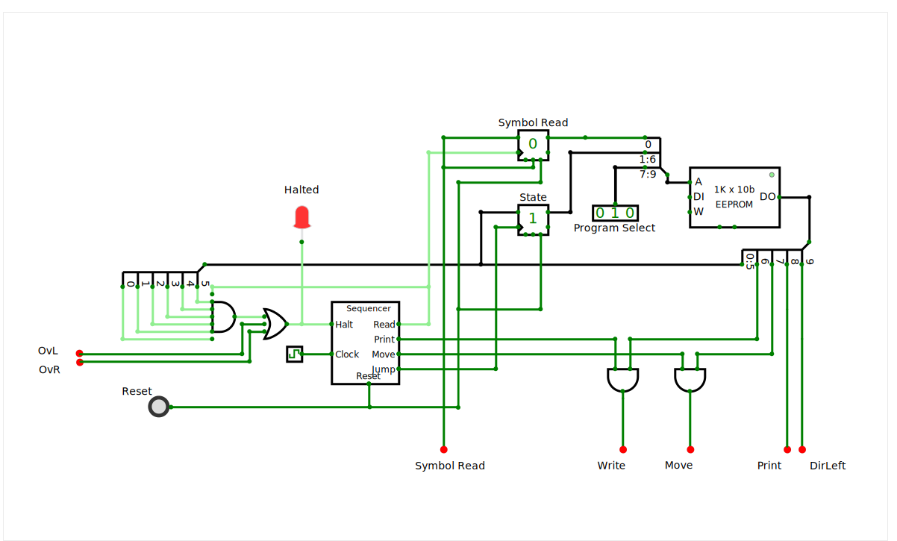
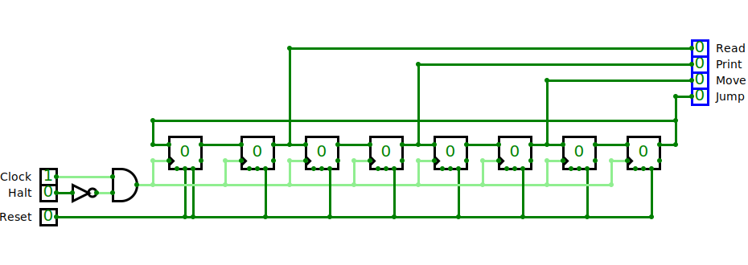

# Turing Machine

A Turing Machine is an idealized machine devised by the British scientist [Alan Turing](https://en.wikipedia.org/wiki/Alan_Turing) for the purpose of proving basic principles of automated data processing.  See the Wikipedia article on the [Turing Machine](https://en.wikipedia.org/wiki/Turing_machine) for further explanation.

The Machine has a *tape* which may have *marks* written on it. The Machine has a *head* which can read a *symbol* from the tape, either a *mark*, that is, a `1` or nothing `0`. Depending on the *state* of the Machine and the *symbol* read, it may write a mark, a `1`, or erase the existing mark, that is, write a `0`, or leave that position or *cell* as it is.  Additionally it may *move* the *tape* one position either to the left or to the right, or stay put.  Finally, the Machine can switch to another *state*, which will determine its next operation.

The Machine was never intended to perform any practical computations, but the model is simple enough that allows to study it theoretically and produce mathematical proves of basic statements which are the basis of all modern computers, one of which is that any machine or programming language that is [Turing Complete](https://en.wikipedia.org/wiki/Turing_completeness) is capable to do whatever other Turing Complete machine can do.  Obviously the Turing Machine is Turing Compatible, but that does not mean that it is practical in any sense, it takes ages to do the most basic operations.  Actually, no actual physical machine can be really *complete* since there is no way you could have an **infinite** tape, as the Machine actually requires.

For example, this is an actual *program* to copy a bunch of contiguous bits derived from [Wikipedia](https://en.wikipedia.org/wiki/Turing_machine_examples#A_copy_subroutine)

| Current State | Current Symbol | Print | Move  | Next State |
| :---------------: | :----------------: | :---: | :---: | :------------: |
|        s0         |         0          |   -   |   R   |       s0       |
|        s0         |         1          |   -   |   -   |       s1       |
|        s1         |         0          |   -   |   -   |      Halt      |
|        s1         |         1          |   0   |   R   |       s2       |
|        s2         |         0          |   -   |   R   |       s3       |
|        s2         |         1          |   -   |   R   |       s2       |
|        s3         |         0          |   1   |   L   |       s4       |
|        s3         |         1          |   -   |   R   |       s3       |
|        s4         |         0          |   -   |   L   |       s5       |
|        s5         |         1          |   -   |   R   |       s1       |
|        s5         |         0          |   1   |   L   |       s5       |

The machine always starts at the first line, in this case with the state `s0`.  The labels assigned to the states are completely arbitrary, they could be `A`, `B` and `C` or whatever unique to each state.  

Then it reads from the *tape* a *symbol*, a `0` or a `1`, or, as it usually is referred in the theoretical papers, a *mark*  or nothing.  Actually, there are Machines that use more than two symbols but, since every Turing Machine is equivalent to any other, a machine with only a 0 or 1 is equivalent to one with 0, 1 and something else.

So, the first two columns decide what to do next. The Machine can print a `0`, a `1` or do nothing, which in this case is represented by a hyphen `-`.  It doesn't mean it prints a hyphen, it means it doesn't change what is already there. 

The next column indicates whether to *move* the tape and which way, `L` for left and `R` for right and, once again, `-` for not moving at all.

The final column tells which state goes next.  The labels in this column should correspond to the labels of the states of the first column. There is a *state* labeled *halt* which means the program has finished, the computation done.

Thus, for example, the very first row, which is the starting point, is state `s0`.  If it reads a `0` from the tape, it does not need to change it but it should move the tape to the right.  After completing the changes, if any, it should go to the state `s0`, that is, it would remain in the current state.  

This line means that the tape will move right until it finds a *mark*, that is, a `1`.  Then the second line applies.  The Machine is still in the `s0` state, but now the symbol read from the tape is a `1` so it will leave that `1` be, it won't move the tape (since it has finally found what it was looking for) but it will go to the state `s1`.

The copy program will locate the first group of consecutive `1` symbols to the left of the reading *head* and make a copy of that group.  For example, if it finds `111` it will produce `1110111` with the `0` right under the reading *head*.

## Description

The circuit is made of two distinct sections.  The upper half is the Turing Machine itself. The bottom part is the *tape* which the Machine is supposed to manipulate.  The *tape* in the theoretical Machine should be infinite, which is not possible for actual machines.  

The following sections describe, the *Machine*, which is the top of the the full circuit in [the on-line emulator](https://circuitverse.org/users/393554/projects/turing-machine-68b18b14-174b-450a-bf01-8f8b94b983d0) followed by the *tape* which is the bottom half ot that circuit.   A series of red dots show the places where the connection in between the two halves have been cut, with labels to reference them.

### The Machine itself

#### The *State*  table.

The Machine is controlled by a memory containing the operations to perform for any state.  It is stored on the EEPROM on the top right of the image.  There is no fundamental reason to use an EEPROM except that the regular [ROM offered by CircuitVerse](https://docs.circuitverse.org/chapter4/chapter4-sequentialelements#rom) is quite lacking.

The relevant pins in this memory are the ones labeled `DO` which is where the data comes out, hence Data Out, and the one labeled `A` for address.  The rest are not used.

The addresses for this memory represent the state of the machine at any point.   It is configured as follows:

* **Program**: 3 bits which allows for 8 different programs that can be stored at once.
* **States**: 6 bits for a total of 64 machine states
* **Symbol**: 1 bit for the symbol, `0` or `1`, under the *head*, which determines which operations to execute for the given state.
  
Up to 8 programs can be stored in the memory.  They can be selected with the input box labeled `Program Select` immediately to its left. In this case the program `010` (binary) which is program 2 (counting from 0.)

Each program is a table of up to 64 possible states.  The operations associated with the state depend on the *symbol* present under the *head*.

The black line connecting the memory and the program selector represents a *bus*, a shorthand representation for a set parallel wires which, if drawn separately, would clutter the diagram. 

There is a *branch* in this *bus* which has numbers in the branches.  They represent the set of bits or wires split on each branch, with `0` representing the least significant bit. In this case, the 3 bits from the program selector are bits `7` to `9`, the next from `1` to `6` represent the *state* and the `0` at the top, the least significant bit, is for the *symbol* read from the head.

Since the *tape* moves, it is not safe to use the *symbol* straight from the head, instead, both the *symbol* and the current *state* are held in two D-type flip-flops (or DFFs) labeled `Symbol Read` and `State`.   DFFs are simple circuits which store just 1 bit or set of bits.  It doesn't have addresses like RAM memories since they hold just one bit or set of bits.  The `Symbol Read` DFF holds just 1 bit, the *symbol* while the *state* DFF holds 6 bits.  It would be nice if CircuitVerse showed a single-bit DFF different from a multi-bit DFF like the *state*, perhaps the contours of single bit DFFs stacked behind the one visible in the front, showing just the edge.

DFFs basically have an input (on the left side, top), a trigger (on the left side, bottom, with a triangle) and an output (on the right side, top).   When the *trigger* input is pulsed, it memorizes whatever is on the *input* and holds it until another pulse comes.  This bit is reflected in the *output* pin, and it also shows in hexadecimal value inside the DFF.

There are just a couple of extra signals worth mentioning.  One is the Reset pin, the rightmost on the bottom edge.  By the way, how do you know which pin is which?  In the interactive emulator, the function of the pin pops up when the cursor hovers above the pin. Anyway, the Reset pin ensures the bit or bits stored are set to a predetermined state when the circuit is powered or, in this case, when the button labeled `Reset` in the bottom-left corner of the image is pressed.  The reset ensures that the DFF for the *state* goes to `0` when turned on, so it starts at the first row in the state table for whichever program was selected.

The other pin is the `preset`, which is in the middle of the bottom.  When the `Reset` is `1`, if `preset` is not connected, as in the *state* DFF, the outout goes to zero.  If `preset` is connected, then the `Reset` sets the value of the `preset`.  It is used in the top DFF, the one for the *symbol* so the *symbol* under the *head*  is read into the DFF at the start.

The input at the `symbol` DFF comes from the line from the red dot at the bottom of the image labeled `Symbol Read`.  That wire comes from the *head* of the *tape* and signals the *symbol* at that position.  This signal goes to the *Symbol Read* DFF both as an input when the DFF is clocked and when it is reset.

#### The operations

So far we  have discussed the memory used to store the state table and the associated circuit to select the program, and look up the various *states* and the operations to perform depending on the *symbol* read.  On the right-hand side of the memory, the `DO` (Data Output) pin consists of 10 bits which control the operations to be performed by the machine.  The line coming out of that `DO` output is a *bus* which can be broken down as follows:

* **Next State**: 6 bits (bits `0` to `5`), the state that follows the current one.  The state `0x3f` or decimal 63 (all bits one) is reserved for HALT, which means the program has finished.
* **Write**: (bit `6`) If 1, the value in **Print** is actually written on the tape, if 0, it is left as-is, which would be equivalent to a hyphen `-` on the state table.
* **Move**: (bit `7`) A `1` means the *tape* must move and if `0` it won't move, equivalent to a `-` in the state table.
* **Print**: (bit `8`) The *symbol* (`0` or `1`) to print on the tape at the current location, valid only if **write** is `1`, ignored otherwise.
* **DirL**: (bit `9`) Direction to move the tape, if the **Move** signal is `1`.  `0` means move right, `1` means left, that is why it is called *direction left*, `DirL`.

The last two signals, `Print` and `DirL` go directly to the *tape* circuit below and will be described later.  

The `Next State` bits go to two destinations.  One is the `State` DFF where they will eventually be used as part of the memory address.   The other destination is a big AND gate at the left edge of the circuit.  And AND gate produces a `1` when and only when all its inputs are `1`.  This big AND gate detects when the next state is all-ones (`0x3f`, decimal 63 or `111111`) which is the code for **Halt** indicating the program has reached the end.  This `halt` signal is fed to the *Sequencer* circuit, described next.

#### The Sequencer.

More or less in the middle of the image above lies block labeled `Sequencer`.   This is what in CircuitVerse is called a *sub-circuit*.  The EEPROM, or the DFFs are all sub-circuits but are predefined and are modelled after actual silicon chips.   CircuitVerse allows the designer to create *sub-circuits* which can be represented as a rectangular block.  Unlike regular built-in circuit elements where the function of the pins is revealed if the cursor hovers over the pin, in *sub-circuits* the pins are labeled within the block, that is why it is full of labels on the inside.

What is a *sequencer*?  Operations in the machine have to be performed in a certain sequence, namely:

1. **Read** the symbol under the *head*.
1. **Print** a new value, or leave it as it is.
1. **Move** the tape left or right or leave it where it is.
1. **Jump** to the new *state*.

The *sequencer* has pins on the right edge labeled for these steps in the sequence and connect to where this operations are to be performed.

The *sequencer* has a `Reset` input at the bottom to ensure the sequence starts at the first step when turned on.

It has a `Clock` input on the bottom left which is fed  from the *clock* circuit element (the wavy green squiggle on a square box to its left).

It also has a `Halt` input on the top left, where the *Halt* signal from the AND gate (and a few others) comes in. This is how the machine is actually stopped, the *Halt* and a couple of error conditions stop the *sequencer* from running.  An red LED is provided in this wire to make this condition visible.

##### Operation of the Sequencer

The `Read` step of the *sequencer* triggers the `Symbol Read` D-Flip-flop at the top center.  It ensures the *symbol* coming from the *tape* below, on the red dot labeled `Symbol Read` remains stable for the rest of the cycle, after all, one of the operations might be to print a new *symbol* on the *tape* and it wouldn't be good if the Machine switches midway through one cycle to somewhere else.

The `Print` step allows the `Write` signal coming from the memory to reach the *tape* on the `Write` red dot at the bottom.  The AND gate acts as a valve controlling when the `Write` bit from memory gets through.  Since the previous *symbol* was stored in the DFF on the previous step, it is safe to alter ir.

Likewise, the `Move` step controls when the `Move` bit from the memory gets through to the *tape*.  The *sequencer* ensures the *tape* moves after the new *symbol*, if any, gets written.

Finally, the `Jump` step triggers the `State` DFF so it stores the memory for the next *State* as instructed in the corresponding bits in memory.  

At this point, a cycle is finished and the *Machine* is in the next *State*, which might as well be the same one if the table said so.

##### Inside the Sequencer

The circuit inside that `Sequencer` block is quite simple, as shown in the image right above.  It is made out of a series of D-type Flip-Flops or DFFs, as the ones we've already seen.  The inputs on each DFF are connected in a round robin fashion to the one before it, with a line going from the output of the right-most DFF to the input of the first DFF.

All the DFFs are connected to the `Reset` line so that all of them will load a `0` except the first one which also has the `preset` pin also connected to the `Reset` line.  That gets a `1` on the first, left-most DFF and `0` on all the rest.

They all share the same `Clock` signal so on each clock cycle, each DFF will load the output of the previous DFF.  Since only one of the has a `1`, on each cycle, that single `1` will move from one DFF to the next until it reaches the last one and then if loops back to the first DFF.

Output lines from every other DFF go to the output pins on the top-right labeled for the steps in the sequence.  For 4 steps we have 8 DFF, the reason being that we want a time gap in between successive steps.  If one step becomes active as the previous one ceases, there is a bit of instability in the transition which may cause the circuit to misbehave.  Thus, we have one DFF for each step plus another DFF for the gap in between.  In a real-life circuit you wouldn't want to have a gap the size of a full clock cycle as we have here, but with the emulator, we have to manage with what is available.

On the left of the image we have the `Halt` input which controls whether the `Clock` signal is fed into the DFFs.  If the `Halt` signal is NOT (that is how the gate is called) `1`, the `Clock` gets through.

### The *tape* 

The tape is at the bottom made up of two sub-circuits, one for the main  cell (the one in the middle) called the Head since there is where the read/write head is and any number of extra cells at either side.   

There are two further cells, one at each end, that are the Overflow cells.  If a program pushes the 1s in the cells past the end, they will light and halt the machine.

Cells are designed so that they can be connected on its sides to its neighbors.  The cells, obviously don't move (like in a real tape) but its contents do.  Zeros are shifted in from the left and right as if the tape has no further marks at either end. 

An ideal Turing Machine should have and infinite tape, which is not realistically possible so, when the tapes moves, bits might spill over the ends.  If this happens, the LEDs at either end will light up and the whole machine will be halted so you can check what happened.  

There is a LED labeled Halted to the center left.  If it lights up it means the program is halted.  If the LEDs at either end of the tape are off, then it is a successful stop.  If either is lit, there was an overflow. 

Labeled boxes are all around showing the values at different points in the circuit.  They are for debugging purposes and do not affect the operation. 

There is a simple sequencer that pulses for each of the four steps for each cycle

1. Read the symbol at the head.
1. Print a new value, or leave it like it is.
1. Move the tape left or right
1. Jump to the new state

The states are stored in the EEPROM on the top-right.  It has plenty of memory for multiple programs.  The memory addresses are split like this:

  
The output of the memory is used to command the actions of the machine,

* Next State: 6 bits, the state that follows the current one.  The state 0x3f or decimal 63 (all bits one) is reserved for HALT, which means the program has finished.
* Print: The symbol (0 or 1) to print on the tape at the current location
* DirL: Direction to move the tape.  0 means right, 1 means left
* Write: If 1, the value in Print is actually printed on the tape, if 0, it is left as-is.
* Move: Likewise, the tape is not always moved so this bit says if it moves and DirL tells which way.
  
## Operation

Select a program to run with the input box pointed at by the red arrow labeled  Program Select.

Select the initial values for the tape in the boxes at the bottom of the screen, pointed at by the arrow labeled Initial Values.

Press the Reset button to the bottom left.

Program has finished when the red Halted LED turns on.  Check the LEDs at both ends of the tape to make sure it hasn't overflowed.

You may restart the program at any time with the Reset button.

## Programs

* 000: Copy.  Set a pattern of up to four consecutive 1s from the central Head cell of the tape to the left.  The program will create a copy of the set. The limitation of 4 is because the tape is not infinite as it theoretically should.  With more than four 1s, it will overflow on the right.

* 001: Busy Beaver: Set all the initial values to 0.  The program will weave its way to produce 6 consecutive cells on.

* 010: An alternate copy, it allows 1s to be anywhere to the left of the Head.  It just has an extra state at the start that moves the tape to the right when it sees a 0 and goes to the same copy algorithm at 000 when it reaches the first 1.

* 011: Test that the machine detects an overflow on the right.  The machine will be halted with the rightmost LED on.

* 100: Test that the machine detects an overflow on the left.  The machine will be halted with the leftmost LED on.

The first two programs were taken from the Wikipedia article: [Turing machine examples](https://en.wikipedia.org/wiki/Turing_machine_examples)

It is better to go Full Screen and select a clock speed of about 50, with the default value of 500 it takes too long.

## Stretching the tape

To change the circuit you will have to clone the project as the original cannot be edited. 

To extend the tape, select and drag either end cell away to make space for the cells to be inserted.  Make sure to move it horizontally so the connecting wires don't get tangled.

Delete the wires on the side that connects it to its neighbor.  There is no need to delete the wires coming from above.

Select any of the intermediate cells by clicking on it (not the main one, nor the end ones) copy it and paste it in any empty space.  This is because it is hard to paste it in the right place at once.  Select that copy and the drag it until the edges of the added cell touch the existing tape.  You may paste and drag as many copies as you want.  Then, drag the end cell you moved aside so it touches the last added cell.   Once again, move it horizontally so the wires don't get messed up.

Draw the bus wires from above the new cells (DirL, Move and Reset) to the connecting points on the top edge.

Select any of the existing LEDs and copy and paste it anywhere empty.  Then select it again and drag it so it plugs into the connection labeled LED in the added cells.

If you want your cells to eventually get initial values set, copy the input boxes from anywhere.

There can only be one Main Cell and one of either type of end cells at the left and right edges. All the cells except for those are exactly the same.

As an alternative, you may do a multiple select by dragging a selection box starting from an empty space and with the shift key pressed, enclosing both the cell, the LED inside and the Initial Value box bellow so, when you paste the new cells into the circuit, the LED and the input box goes with it.  Likewise you may use the multiple select to pick more than one cell (and its LEDs and input boxes) and copy and paste them all at once. 